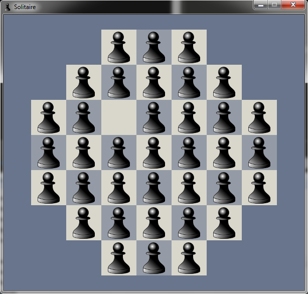

# Pygame-Solitaire
A simple solitaire game created with Python and Pygame

## Screenshot

## Credits

 - The pictures of pawns are from [Pixabay](https://pixabay.com/)
 - The color is from [Adobe Color](https://color.adobe.com/)
